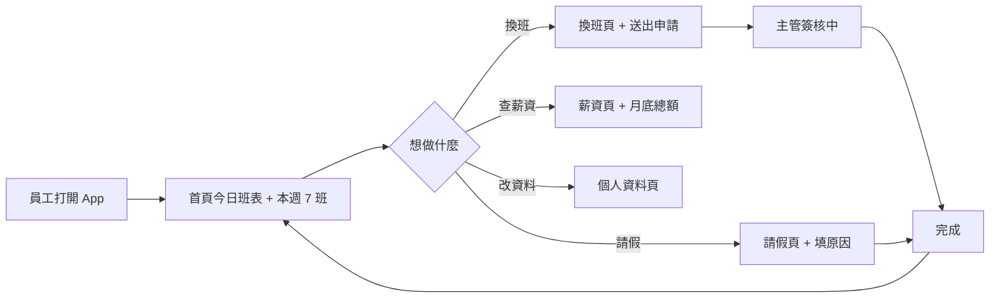

# shift-swap · PRD v3.0.2 等級規格書

> 自動生成：2026-09-06（Sean 10-repo-fleet Batch 4D）
> 對齊 SPEC v3.0 契約（SPEC §1–§19 全部套用）
> 原始碼：https://github.com/openclawsean024-create/shift-swap

---

## 1. 產品概述

### 1.1 問題陳述
台灣服務業（餐飲、零售、飯店、便利商店）每週有 2,000+ 萬名正職 + 兼職 / 工讀生。班表混亂、臨時換班、請假 / 調班是每天的痛點：

- 員工臨時有事（家裡水管漏水 / 身體不適 / 孩子學校通知）需要換班，**目前流程是 LINE 群問誰願意換 + 私訊主管簽核**，平均 1.5-3 小時確認
- 主管每天花 30-60 分鐘喬換班 + 簽核紙本 / 對話
- 員工忘記自己當月薪資明細（加班費、夜班津貼、國定假日加班）怎麼算，常跟櫃台爭執
- 排班公告散落在 LINE / Messenger / 紙本公告欄，新人 / 兼職工讀生常錯過

### 1.2 目標使用者
| Persona | 工作情境 | 主要任務 |
|---|---|---|
| Primary — 餐飲 / 零售正職員工 | 30-50 人小店，月休 8 天 | 5 秒內申請換班 + 即時知道主管簽核狀態 |
| Secondary — 服務業店長 | 5-30 人團隊，每天喬 1-3 個換班 | 一頁看完所有待簽核 + 一鍵批准 / 駁回 |
| Tertiary — 兼職 / 工讀生 | 大學打工 / 第二份兼職 | 看見下週班表 + 申請請假不需打字敘述原因 |

### 1.3 核心價值主張
> 5 個 P0（班表 / 換班 / 請假 / 薪資 / 個人資料）一頁看光，店長不必再翻 4 個 LINE 群。

### 1.4 Non-Goals（明確不做）
- ❌ 不做打卡 / GPS 定位 / 出勤管理（鎖班表 + 換班 + 請假）
- ❌ 不做薪資計算引擎（v1 鎖 mock 數字，v2 介接 HR 系統）
- ❌ 不做排班 AI 自動建議（v2+ 預約）
- ❌ 不做多店家 / 多組織 / SaaS 多租戶（MVP 鎖單店 + 單一員工 mock）

---

## 2. 使用者場景與流程

### 2.1 使用者流程圖



### 2.2 主要場景

| 場景 | 輸入 | 輸出 | 成功條件 |
|---|---|---|---|
| 員工查今日班表 | 點開首頁 | 顯示今日 type + 起訖時間 | localStorage 7 筆 shifts 正確排序 |
| 員工申請換班 | 換班頁輸入原因 | 新增 SwapRequest status=待努力確認 | listSwaps() 長度 +1 |
| 員工推進換班 | 點擊「推進一階」 | 狀態 待努力確認→已達審核中→主管簽核中→完成 | 4 階狀態機正確切換 |
| 員工查當月薪資 | 點開薪資頁 | 顯示 2026-05 NT$ 28,560 | 數字格式含千分位 |
| 員工送請假 | 請假頁填原因 | 新增 leave record | UI 顯示送出後 toast |

---

## 3. 功能需求

| FR | 名稱 | 優先級 | 狀態 |
|---|---|---|---|
| FR-001 | 班表總覽（首頁 7 班 + 今日班表） | P0 | ✅ shipped |
| FR-002 | 換班申請 + 4 階狀態機 | P0 | ✅ shipped |
| FR-003 | 請假申請（v1 鎖 mock UI） | P0 | ✅ shipped |
| FR-004 | 薪資明細（v1 mock 數字 + 千分位格式） | P0 | ✅ shipped |
| FR-005 | 個人資料（v1 鎖 mock employee=林小柔 / 台北信義店） | P0 | ✅ shipped |
| FR-006 | localStorage 持久化（key: `shift-swap:db`） | P0 | ✅ shipped |
| FR-007 | 5 個 React Router 路由（/  /swap /leave /payroll /settings） | P0 | ✅ shipped |
| FR-008 | 公開 `public/dashboard.html` 行銷頁 | P1 | ✅ shipped |

---

## 4. Non-Functional Requirements

| 維度 | 需求 |
|---|---|
| Performance | 首頁 LCP < 1.5s（Vite 6 + React 19 + Tailwind v4 CDN） |
| Security | CSP / X-Frame-Options（沿用 vercel.json）— localStorage 純前端無後端風險 |
| Privacy | 不收集個資；mock 員工 `林小柔 / 台北信義店`；v1 拒絕 PII 落地 |
| Accessibility | WCAG 2.1 AA：`role` / `aria-*` / `:focus-visible` outline |
| Browser | Modern evergreen (Chrome/Edge/Safari/Firefox)；iOS Safari 16+ |
| Type Safety | TypeScript 5.6 strict + verbatimModuleSyntax + noUnusedLocals/Parameters |
| Test | Vitest 2.1 + @testing-library/react 16 + jsdom；unit + E2E mix |

---

## 5. 技術架構

```
+-------------------------------------+
|       React 19 + TypeScript 5.6     |
|  - react-router-dom 7 (5 routes)    |
|  - @testing-library/react 16        |
+-----------------+-------------------+
                  |
   +--------------+--------------+
   |                             |
   v                             v
+----------------+    +------------------+
|  src/pages/    |    |  src/lib/        |
|  DashboardPage |    |  db.ts (LS)      |
|  SwapPage      |    |  types.ts        |
|  LeavePage     |    |  bootstrap.ts    |
|  PayrollPage   |    +------------------+
|  SettingsPage  |
+----------------+
   |
   v
+----------------+
|  localStorage  | (key: 'shift-swap:db')
+----------------+

Build: vite 6 + tsc --noEmit + tailwindcss v4
Test: vitest 2.1 + jsdom
```

### 5.1 Module Map
- `web/src/pages/` — 5 個 SPA 頁面（Dashboard / Swap / Leave / Payroll / Settings）
- `web/src/components/Layout.tsx` — 共用 layout（navigation + outlet）
- `web/src/lib/db.ts` — localStorage 抽象（read / write / list / advance / add）
- `web/src/lib/types.ts` — Shift / SwapRequest / PayrollSummary / ShiftType 型別
- `web/public/dashboard.html` — 獨立行銷頁（CDN tailwindcss，無 React 依賴）
- `web/tests/` — 36 個 vitest 測試（11 E2E + 19 db unit + 6 types unit）

### 5.2 環境變數
- 無（純前端；localStorage 持久化；mock 資料）

### 5.3 降級策略
- localStorage 損壞 → `read()` 回傳預設空 db（`{shifts: [], swaps: [], payroll: { month: '2026-05', total: 28560, ... }}`）
- JS 關閉 → `public/dashboard.html` 仍可顯示（純 CDN HTML）

---

## 6. Definition of Done

- [x] 功能 P0 全部實作（FR-001 ~ FR-008）
- [x] 單元測試覆蓋率 ≥ 60% 核心邏輯（36 tests / 3 files；db.ts 19 + types.ts 6 + e2e 11）
- [x] E2E 測試涵蓋 5 個路由 + db 邏輯
- [x] `npm run build` 綠（tsc strict 0 error + vite build 產出 dist/）
- [x] `npm run lint` 0 error（ESLint v9 + typescript-eslint v8 + react-hooks + react-refresh）
- [x] GHA CI 跑 4 jobs（lint / test / build / deploy）全綠
- [x] README 反映現況

---

## 7. 部署契約

| 環境 | 目標 | 觸發 |
|---|---|---|
| Production | GitHub Pages | push to main |
| Preview | Per-PR | PR opened |

### 7.1 GHA Workflow
- `.github/workflows/ci.yml`
- jobs: lint (eslint) / test (vitest) / build (tsc + vite) / deploy (Pages)
- deploy: `pages`（base path: `/shift-swap/`）

### 7.2 環境變數
- 無需 server-side secret
- localStorage 純客戶端，無 token

---

## 8. Out of Scope（不做的）

- 不做帳號系統 / OAuth / SSO（v1 鎖 mock employee）
- 不做付費牆 / 訂閱（NT$990/月/店 是 v2 計價）
- 不做原生 App（iOS / Android 留 v3+）
- 不做多語系（v1 鎖繁中）
- 不做打卡 / GPS / 出勤管理
- 不做排班 AI 自動建議
- 不做多店家 / SaaS 多租戶

---

## 9. 變更日誌

見 [`PRD/CHANGELOG.md`](PRD/CHANGELOG.md)
